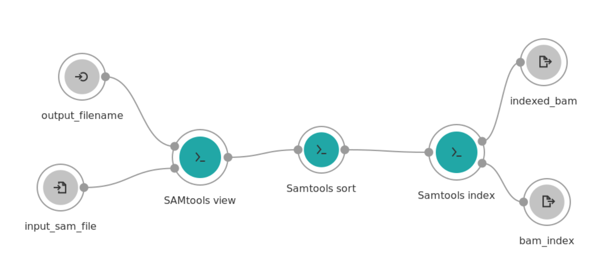

# BioC 19 CWL workshop errata

1. In Figure 3. (CommandLineTool example - Samtools view) bam_output type should be 'File' and not 'File?'. The question mark would indicate that the output is not required so the task won't fail when the ouput is not created. 

2. I've exposed the output_filename port to make the image more in line with the CWL description.



3. The example command line contains hardcoded paths to data from the pasilla package and the paths will be different from my machine. To see how the command line should look like for you, run:

```R
sprintf("Rscript exscrDoc.R --counts %1$s/treated1fb.txt --counts %1$s/treated2fb.txt --counts %1$s/treated3fb.txt --counts %1$s/untreated1fb.txt --counts %1$s/untreated2fb.txt --counts %1$s/untreated3fb.txt --counts %1$s/untreated4fb.txt --phenodata %1$s/pasilla_sample_annotation.csv --factor condition --control type", system.file("extdata", package = "pasilla"))
```